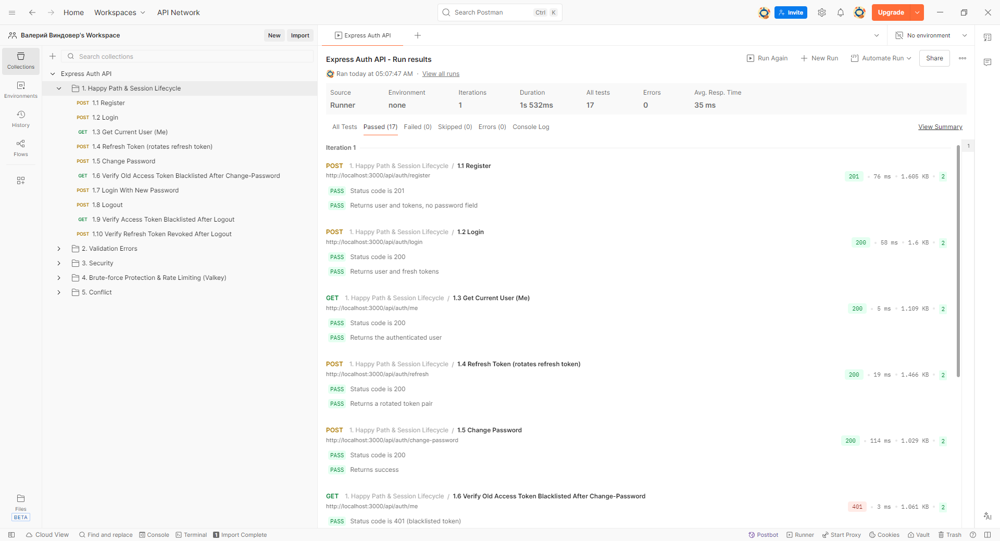
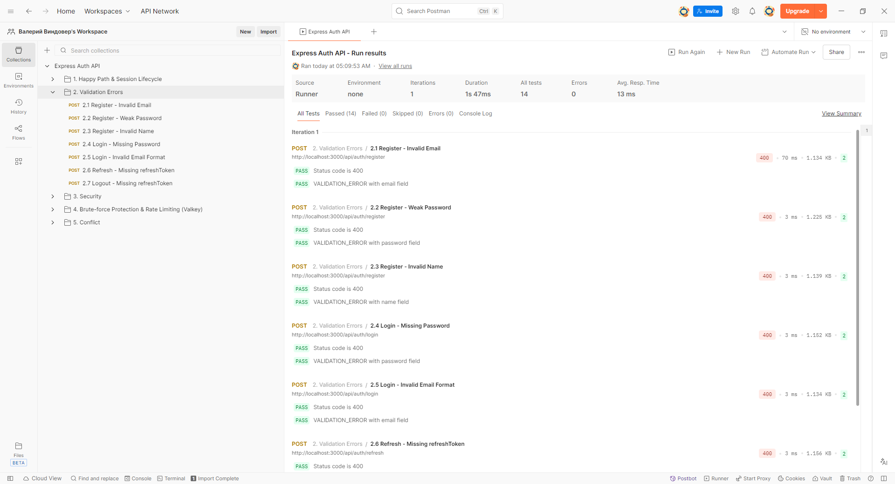
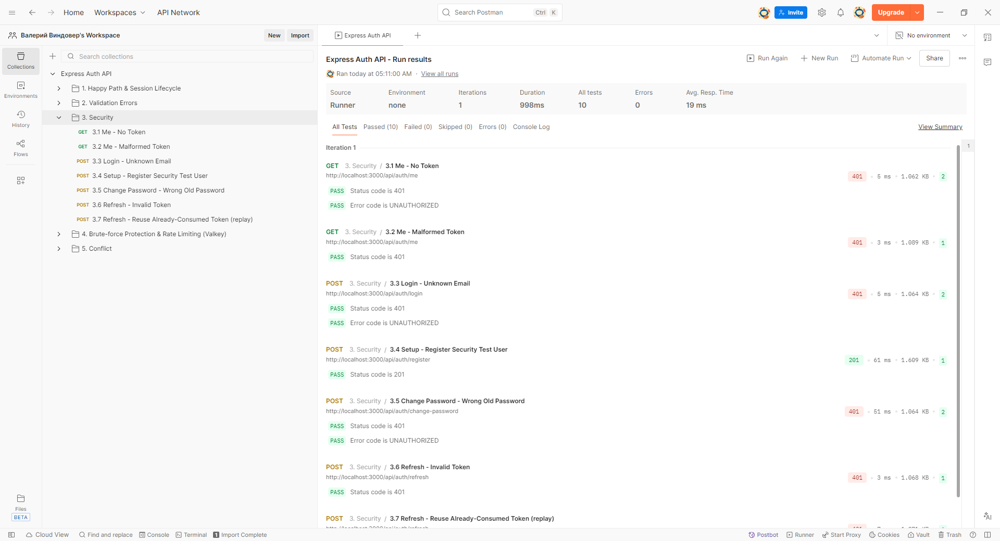
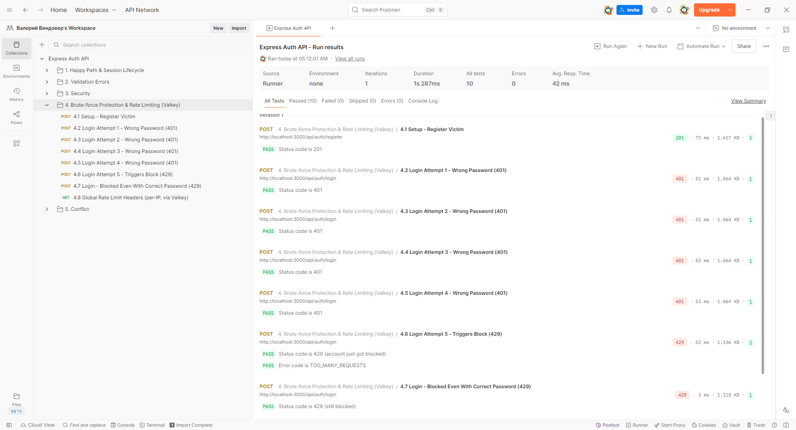
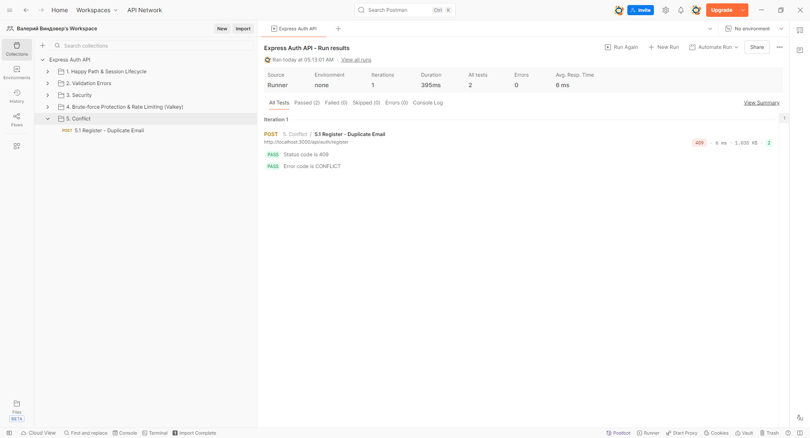

# Express Auth

REST API для авторизации пользователей на Node.js + Express + Prisma ORM + MySQL + Valkey (Redis-совместимое хранилище) + Zod.

## Стек технологий

- **Node.js** + **TypeScript** (строгий режим)
- **Express 5**
- **Prisma ORM** (MySQL, через `@prisma/adapter-mariadb`)
- **Valkey** (Redis-совместимый) — сессии, блокировка брутфорса, rate limiting, blacklist токенов
- **Zod** — валидация запросов и автогенерация OpenAPI-схемы
- **JWT** (access + refresh токены с ротацией)
- **bcrypt** — хеширование паролей
- **Docker / Docker Compose**
- **Jest** + **Supertest** — unit и интеграционные тесты

## Возможности

- Регистрация / логин / выход / обновление токенов / смена пароля / текущий пользователь
- Access + refresh токены с ротацией refresh-токена при каждом обновлении
- Блокировка аккаунта после 5 неудачных попыток входа на 15 минут (настраивается)
- Blacklist access-токенов в Valkey при logout и смене пароля
- Инвалидация всех сессий пользователя при смене пароля
- Rate limiting (100 запросов/мин на IP) через Valkey
- Единый формат ответов и ошибок, коды ошибок (`VALIDATION_ERROR`, `UNAUTHORIZED`, `CONFLICT`, `TOO_MANY_REQUESTS` и т.д.)
- Swagger UI с документацией, сгенерированной прямо из Zod-схем валидации

## Быстрый старт (Docker)

Требуется только Docker и Docker Compose.

```bash
git clone https://github.com/BaJIepka/express-auth.git
cd express-auth

# (опционально) скопировать и при желании отредактировать переменные окружения
cp .env.example .env

docker compose up --build
```

Поднимутся три контейнера: `mysql`, `valkey` и `app`. Приложение само применяет миграции Prisma при старте (`prisma migrate deploy`) и слушает `http://localhost:3000`.

Проверить:

```bash
curl http://localhost:3000/api-docs.json
```

Swagger UI: [http://localhost:3000/api-docs](http://localhost:3000/api-docs)

Остановить и удалить контейнеры вместе с данными:

```bash
docker compose down -v
```

## Локальный запуск без Docker (для разработки)

Предполагается, что MySQL и Valkey доступны (проще всего поднять их через Docker, а само приложение — локально):

```bash
npm install

# Поднять только БД и Valkey
docker compose up -d mysql valkey

cp .env.example .env
# DATABASE_URL и REDIS_URL из .env.example уже указывают на localhost — менять не нужно

npx prisma migrate dev

npm run dev
```

Сервер стартует на `http://localhost:3000` с автоперезапуском (`tsx watch`).

## Переменные окружения

См. [.env.example](.env.example). Основные:

| Переменная                 | Описание                                    | По умолчанию             |
| -------------------------- | ------------------------------------------- | ------------------------ |
| `NODE_ENV`                 | Окружение                                   | `development`            |
| `PORT`                     | Порт HTTP-сервера                           | `3000`                   |
| `DATABASE_URL`             | Строка подключения к MySQL                  | —                        |
| `REDIS_URL`                | Строка подключения к Valkey                 | `redis://localhost:6379` |
| `JWT_SECRET`               | Секрет для подписи JWT, минимум 32 символа  | —                        |
| `ACCESS_TOKEN_EXPIRES_IN`  | Время жизни access-токена                   | `15m`                    |
| `REFRESH_TOKEN_EXPIRES_IN` | Время жизни refresh-токена                  | `7d`                     |
| `BCRYPT_SALT_ROUNDS`       | Стоимость хеширования bcrypt                | `10`                     |
| `MAX_LOGIN_ATTEMPTS`       | Число неудачных попыток входа до блокировки | `5`                      |
| `LOGIN_BLOCK_DURATION`     | Длительность блокировки, минут              | `15`                     |

## Эндпоинты API

Базовый префикс: `/api/auth`

| Метод | Путь               | Описание             | Тело запроса                   | Требует access token                                                                   |
| ----- | ------------------ | -------------------- | ------------------------------ | -------------------------------------------------------------------------------------- |
| POST  | `/register`        | Регистрация          | `{ email, password, name }`    | нет                                                                                    |
| POST  | `/login`           | Вход                 | `{ email, password }`          | нет                                                                                    |
| POST  | `/refresh`         | Обновление токенов   | `{ refreshToken }`             | нет                                                                                    |
| POST  | `/logout`          | Выход                | `{ refreshToken }`             | нет (но если передан заголовок `Authorization`, access-токен тоже попадёт в blacklist) |
| GET   | `/me`              | Текущий пользователь | —                              | да                                                                                     |
| POST  | `/change-password` | Смена пароля         | `{ oldPassword, newPassword }` | да                                                                                     |

Формат успешного ответа:

```json
{ "success": true, "data": { ... } }
```

Формат ошибки:

```json
{
  "success": false,
  "error": {
    "code": "VALIDATION_ERROR",
    "message": "Ошибка валидации",
    "details": [{ "field": "email", "message": "Неверный формат email" }]
  }
}
```

Полная интерактивная документация — в Swagger UI (`/api-docs`) после запуска сервера.

## Postman-коллекция

Готовая коллекция лежит в [postman/express-auth.postman_collection.json](postman/express-auth.postman_collection.json) — импортируйте её в Postman (File → Import) и запустите через Collection Runner при поднятом сервере (`http://localhost:3000`).

Покрывает:

- **1. Happy Path & Session Lifecycle** — register → login → me → refresh (с ротацией) → change-password → повторный login → logout, с проверкой, что старые access/refresh токены после смены пароля и logout действительно становятся недействительны (blacklist в Valkey)
- **2. Validation Errors** — некорректные email/пароль/имя, отсутствующие обязательные поля
- **3. Security** — запросы без токена, с "мусорным" токеном, неверный старый пароль, повторное использование уже использованного refresh-токена
- **4. Brute-force Protection & Rate Limiting** — блокировка после 5 неудачных попыток входа, проверка заголовков `X-RateLimit-*`
- **5. Conflict** — повторная регистрация на уже занятый email

Каждый запрос содержит встроенные тесты (вкладка Tests), автоматически проверяющие статус-код и тело ответа — во вкладке Postman Runner будет видно "зелёный" результат по каждому сценарию.

### Скриншоты прогона

Результаты Collection Runner — все тесты пройдены (0 failed / 0 errors по каждой папке):

| Happy Path & Session Lifecycle               | Validation Errors                                          |
| -------------------------------------------- | ---------------------------------------------------------- |
|  |  |

| Security                                 | Brute-force Protection & Rate Limiting                               |
| ---------------------------------------- | -------------------------------------------------------------------- |
|  |  |

| Conflict                                 |
| ---------------------------------------- |
|  |

## Тесты

Интеграционные тесты требуют реальные MySQL и Valkey (поднимаются через Docker):

```bash
docker compose up -d mysql valkey
cp .env.example .env   # если ещё не сделано

npm run test:unit          # unit-тесты (моки)
npm run test:integration   # интеграционные тесты (реальная БД/Valkey)
npm test                   # оба набора
npm run test:coverage      # с отчётом покрытия
```

## Полезные npm-скрипты

| Команда                             | Назначение                                              |
| ----------------------------------- | ------------------------------------------------------- |
| `npm run dev`                       | Запуск в режиме разработки с автоперезагрузкой          |
| `npm run build`                     | Сборка в `dist/` (компиляция TS + резолв алиасов `@/*`) |
| `npm start`                         | Запуск собранной версии из `dist/`                      |
| `npm run lint` / `lint:fix`         | Проверка/автофикс ESLint                                |
| `npm run format` / `format:check`   | Prettier                                                |
| `npm run prisma:migrate`            | Создание/применение миграции в режиме разработки        |
| `npm run prisma:studio`             | Prisma Studio                                           |
| `npm run docker:up` / `docker:down` | Поднять/остановить окружение через Docker Compose       |

## Структура проекта

```
src/
├── config/       # Prisma Client, Valkey Client, валидация env
├── middleware/    # auth, rate limiter, error handler, zod-валидация
├── controllers/   # HTTP-слой (тонкий, без бизнес-логики)
├── services/      # Бизнес-логика (auth, токены, Valkey)
├── validators/    # Zod-схемы запросов
├── routes/        # Роуты Express
├── docs/          # Генерация OpenAPI-схемы из Zod и Swagger UI
├── utils/         # JWT, bcrypt, логгер, вспомогательные функции
└── index.ts       # Точка входа
prisma/
├── schema.prisma
└── migrations/
tests/
├── unit/          # Изолированные тесты с моками
└── integration/   # Тесты через supertest поверх реальных MySQL/Valkey
```

Небольшое отличие от схемы в ТЗ: `RefreshToken.token` объявлен как `@db.VarChar(512)` (вместо дефолтного `VARCHAR(191)` для уникального индекса в MySQL) — JWT-строки обычно длиннее 191 символа, поэтому дефолтная длина ломала бы уникальный индекс.
